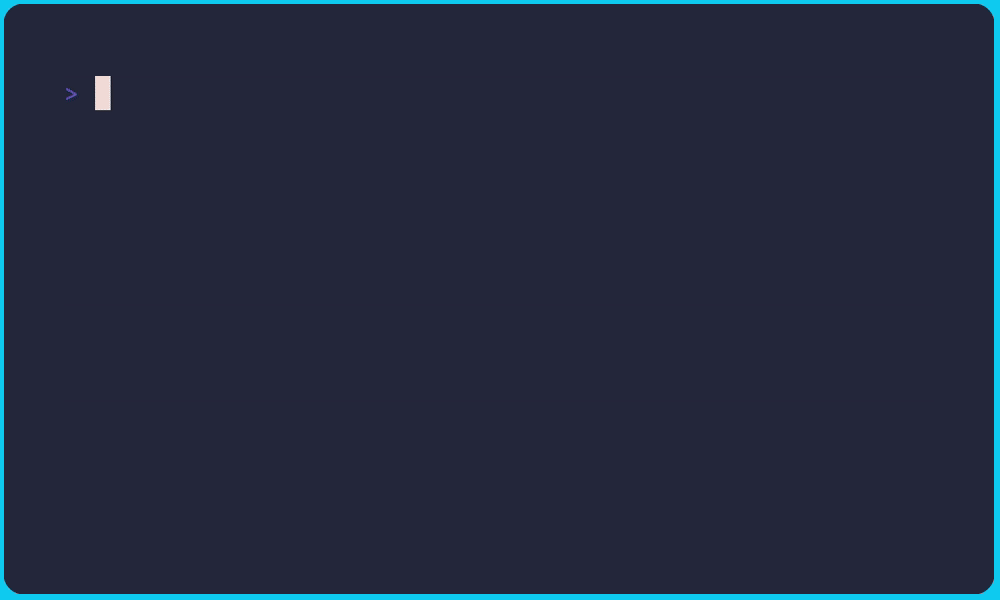

# 💻 Vgo

## 📝 Overview

Vgo is a simple go project scaffolding tool with user-friendly command-line interface written in Go. This tool saves time, ensures consistent project structure, and improves development efficiency.

> **NOTE** : This is my first open source contribution. I hope this tool will be useful to many developers and help them in their projects. I am open to feedback and suggestions to improve this tool further.
This is the first version of the tool and I will be adding more features and improvements in the future.

## 🚀 Demo


See it is that simple to create a new project with vgo. Just run the command `vgo init` and answer the questions to create a new project.

## ✨ Features

- **Dynamic File Generation**: Creates boilerplate code files tailored to your project.
- **Customizable Templates**: Supports user-defined templates for flexibility.
- **Instant Setup**: Quickly scaffold a new project by leveraging go routines.
- **Cross-Platform**: Runs seamlessly on Windows, macOS, and Linux.

## 🎯 Todo

This is the list of features that I am planning to add in the future. I will be working on these features in the upcoming versions.

- [ ] Add support for custom templates.
- [ ] Improve project structure.
- [ ] Configure project settings using a configuration file.
- [ ] Implement addons features (basic auth, logging, caching and testing setup).

## ⬇️ Installation

### Prerequisites
- [Go](https://golang.org/dl/) (Version 1.23.3 or higher is recommended)

### 1. Using `go install`

```bash
go install github.com/vg006/vgo@latest
```

### 2. Building from Source

1. Clone the repository:
   ```bash
   git clone https://github.com/vg006/vgo.git
   cd vgo
   ```

2. Build the binary:
   ```bash
   go build -o vgo
   ```

3. Install the binary to your Go bin directory:
   ```bash
    go install
    ```
   (or)
   Add the binary to your PATH:
   ```bash
   export PATH=$PATH:$(pwd)
   ```

## 🛠️ Usage

**Initialize a new project with default settings**:
```bash
vgo init
```

### Available Flags

| Flag            | Description                                         |
|-----------------|-----------------------------------------------------|
| `--help`        | Display help information.                           |


## 📄 License

This project is licensed under the [MIT License](LICENSE).

## 🤝 Contributing

Contributions are welcome! Please follow these steps:

1. Fork the repository.
2. Create a new branch:
   ```bash
   git checkout -b feature/your-feature
   ```
3. Commit your changes:
   ```bash
   git commit -m "Add your feature"
   ```
4. Push the branch:
   ```bash
   git push origin feature/your-feature
   ```
5. Open a pull request.

## 💪 Support

If you encounter any issues or have questions, feel free to open an issue on [GitHub](https://github.com/vg006/vgo/issues).

## 🙏 Acknowledgments

Special thanks to,
- the Go community, for their invaluable resources and inspiration.
- [MelkeyDev](https://github.com/MelkeyDev), for the inspiration to build this tool.
- [Cobra CLI](https://github.com/spf13/cobra), for helping to build command-line interface.
- [Charm_](https://github.com/charmbracelet), for building beautiful and interactive CLI components.
